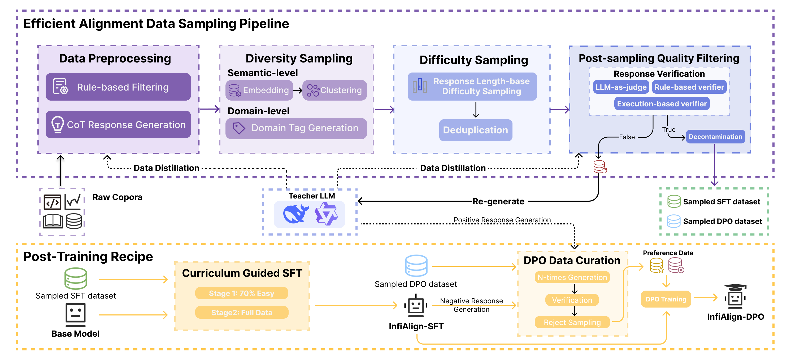

---
title: "InfiAlign: A Scalable and Sample-Efficient Framework for Enhancing LLM Reasoning"
date: 2025-08-12
slug: "infialign"  
keywords: 
  - LLM Alignment
  - Reasoning Enhancement
  - Data Efficiency
author: "Shuo Cai et al."
category: "publication"
tags: ["LLM Alignment", "Reasoning", "SFT", "DPO", "AI Research"]
categories: ["AI", "Machine Learning"]
summary: "InfiAlign is a novel framework that combines SFT and DPO with an advanced data selection pipeline to efficiently enhance LLM reasoning capabilities."
description: "We present InfiAlign, a scalable post-training framework that achieves state-of-the-art reasoning performance while using only 12% of typical training data."
featured: true
weight: 1
---

<!-- Hero Image -->
<div align="center">
  
</div>

<!-- Quick Links -->
<div align="center" style="margin: 20px 0; display: flex; justify-content: center; gap: 15px; flex-wrap: wrap;">
  <a href="https://arxiv.org/abs/2508.05496" style="padding: 8px 15px; background-color: #B22222; color: white; border-radius: 5px; text-decoration: none;">📚 Paper</a>
  <a href="https://github.com/InfiXAI/InfiAlign" style="padding: 8px 15px; background-color: #24292e; color: white; border-radius: 5px; text-decoration: none;">💻 Code</a>
  <a href="https://huggingface.co/InfiX-ai/InfiAlign-Qwen-7B-SFT" style="padding: 8px 15px; background-color: #FFD700; color: black; border-radius: 5px; text-decoration: none;">🤗 SFT Model</a>
  <a href="https://huggingface.co/InfiX-ai/InfiAlign-Qwen-7B-DPO" style="padding: 8px 15px; background-color: #FFD700; color: black; border-radius: 5px; text-decoration: none;">🤗 DPO Model</a>
</div>

**InfiAlign** isn't just another alignment framework—it's your new secret weapon for supercharging LLMs! By ingeniously combining **supervised fine-tuning (SFT)** and **Direct Preference Optimization (DPO)** with our smart data selection pipeline, we achieve remarkable reasoning improvements while using only a fraction of typical training data. Talk about doing more with less! 😉

## 🌟 Why InfiAlign Stands Out

At its heart lies our **efficient data pipeline** – an automated curator that handpicks the crème de la crème from open-source reasoning datasets using multidimensional quality metrics. When tested on [Qwen2.5-Math-7B-Base](https://huggingface.co/Qwen/Qwen2.5-Math-7B), the results were mind-blowing:
- Matches [DeepSeek-R1-Distill-Qwen-7B](https://huggingface.co/deepseek-ai/DeepSeek-R1-Distill-Qwen-7B)'s performance using just **12%** of the data! (Your GPU just breathed a sigh of relief 😌)
- **DPO magic** delivers an extra boost, particularly in math tasks (+3.89% on AIME benchmarks) 

### 🚀 Key Contribution
1. **Data-Efficient Alignment via Multi-Dimensional Filtering.** We design an automated pipeline that selects high-quality instruction data from open-source corpora using diversity, difficulty, and quality metrics, achieving strong performance with only $\sim$20\% of the data used by distilled baselines.
2. **Modular and Scalable Framework.** InfiAlign enables seamless integration of new data sources and tasks via its modular design, allowing flexible and low-overhead adaptation across domains.
3. **Enhanced Reasoning through Multi-Stage Training.** We adopt a multi-stage training regimen that balances data mixing, curriculum-guided SFT, and DPO to boost reasoning across various benchmarks.

## 🎉 Hot Off the Press!
- ⏳ ***Teaser Alert*** Our InfiAlign-SFT is getting an RL-powered upgrade - watch this space! 
- 🔥 ***`2025/08/11`*** Our models are partying on HuggingFace! Meet [InfiAlign-Qwen-7B-SFT](link) and [InfiAlign-Qwen-7B-DPO](link) 🎊
- 🔥 ***`2025/08/07`*** Paper alert! "[InfiAlign: A Scalable and Sample-Efficient Framework for Aligning LLMs to Enhance Reasoning Capabilities](https://arxiv.org/abs/2508.05496)" is now on arXiv 

## 🧠 Methodology Overview

### Data Selection Pipeline
Traditional alignment methods often require massive amounts of training data, which is computationally expensive and can lead to diminishing returns. Our data-efficient approach addresses this by: (1) eliminating redundant or low-quality samples through multi-dimensional filtering (diversity, difficulty, quality), and (2) optimizing the training curriculum to focus on the most impactful examples. This enables comparable performance to distilled baselines using only 20% of the data, while maintaining strong generalization across reasoning tasks.

Our data curation process transforms raw datasets into high-quality reasoning corpora:
1. **Data Preparation**: Aggregates QA pairs from multiple sources, standardizes formats, and generates missing Chain-of-Thought traces using teacher models
2. **Diversity Sampling**: Balances domain representation (Algebra, Geometry, etc.) and ensures semantic variety through clustering
3. **Difficulty Sampling**: Prioritizes complex problems using response length as a proxy for difficulty
4. **Quality Control**: Validates answer correctness through automated verifiers and LLM scoring
5. **Benchmark Protection**: Implements rigorous decontamination to prevent data leakage

### Training Framework
**Supervised Fine-Tuning**:
- Utilizes two curated datasets (95K and 165K samples) distilled from 10M+ examples
- Employs two-phase training: foundational skills development followed by advanced reasoning tasks

**Direct Preference Optimization**:
- Constructs preference pairs by comparing SFT model errors with expert solutions
- Implements three refinement steps: data cleaning, challenge selection, and quality verification
- Optimizes using the DPO objective function to enhance reasoning capabilities

## 🏆 Benchmark Results: Breaking Efficiency Barriers

InfiAlign redefines the performance-efficiency tradeoff, achieving SOTA results with only **12%** of typical training data. Our models outperform larger competitors across mathematical, scientific, and coding domains:

### Key Achievements:
- **3.89% avg gain** on AIME 24/25 math competitions and **92.7% accuracy** on MATH500, with 79% less data than DeepSeek-Distill
- Demonstrates **excellent generalization** across tasks in different fields

### Detailed Breakdown:

| Model | Initial Checkpoint | Data Size | AIME 2025 | AIME 2024 | MATH500 | GPQA | MMLU-Pro | LiveCodeBench | Avg. |
|-------|--------------------|-----------|-----------|-----------|---------|------|----------|---------------|------|
| Qwen2.5-7B-Instruct | Qwen2.5-7B-Base | 1M | 8.80 | 11.93 | 76.15 | 38.70 | 57.49 | 15.77 | 34.80 |
| DeepSeek-Distill-Qwen-7B | Qwen2.5-7B-Math-Base | 800K | 37.97 | 55.50 | 92.80 | 49.10 | 54.16 | 37.60 | 54.43 |
| **InfiAlign-SFT (ours)** | Qwen2.5-7B-Math-Base | 165K | 42.19 | **63.75** | 92.70 | **53.60** | 56.68 | 36.20 | **57.52** |
| **InfiAlign-DPO (ours)** | InfiAlign-SFT | 10K | **47.45** | 61.25 | **93.45** | 51.77 | 53.95 | 35.30 | 57.20 |


## 📚 Citation Information

If you find this work useful, citations to the following papers are welcome:

```bibtex
@misc{cai2025infialignscalablesampleefficientframework,
      title={InfiAlign: A Scalable and Sample-Efficient Framework for Aligning LLMs to Enhance Reasoning Capabilities}, 
      author={Shuo Cai and Su Lu and Qi Zhou and Kejing Yang and Zhijie Sang and Congkai Xie and Hongxia Yang},
      year={2025},
      eprint={2508.05496},
      archivePrefix={arXiv},
      primaryClass={cs.AI},
      url={https://arxiv.org/abs/2508.05496}, 
}
```
